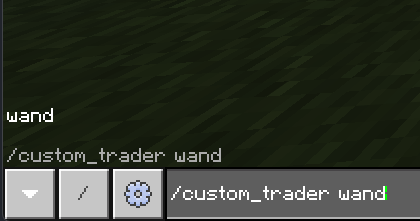
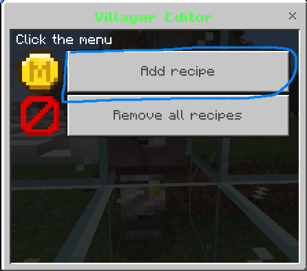
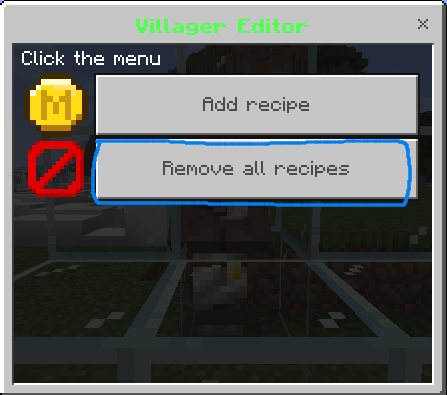
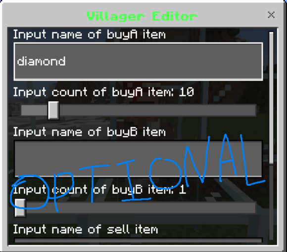
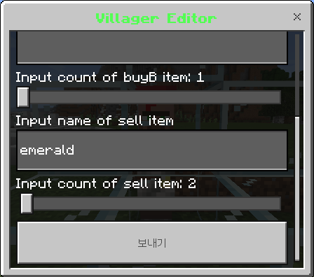
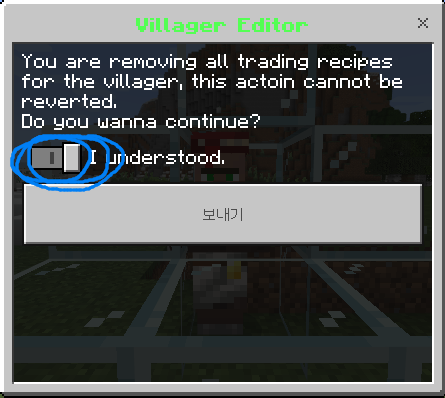
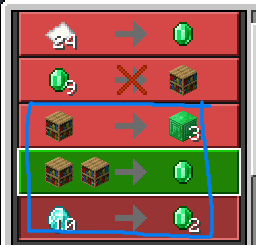

# customtrade Plugin

The plugin for bdsx

# Usage

1. Get wand 
   

2. Hit or Right-Click a villager 
    
     
   

3. Input the informations 
    
    
     
    

4. Send 
   

# License

MIT
